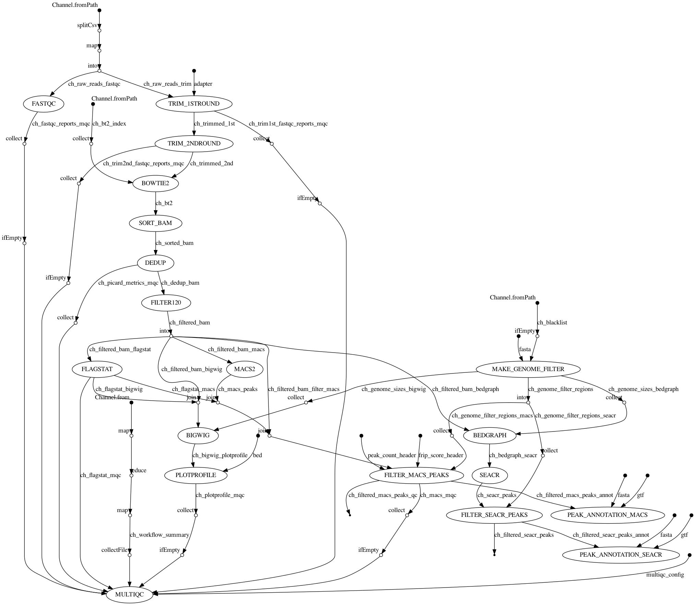

# CUTRUN_Nextflow
CUT&amp;RUN-seq analysis pipeline built using Nextflow.

Short-read trimming and alignment processes are based on the following paper:
[Zhu, Q., Liu, N., Orkin, S.H. et al. CUT&RUNTools: a flexible pipeline for CUT&RUN processing and footprint analysis. Genome Biol 20, 192 (2019). https://doi.org/10.1186/s13059-019-1802-4](https://genomebiology.biomedcentral.com/articles/10.1186/s13059-019-1802-4)

MACS2 and [SEACR](https://github.com/FredHutch/SEACR) can be used to call peaks.

## Flowchart



## Usage
```bash
$nextflow run khigashi1987/CUTRUN_Nextflow -r main --help
N E X T F L O W  ~  version 20.10.0
Launching `./main.nf` [nice_pasteur] - revision: 48ae873b6f
Usage:
The typical command for running the pipeline is as follows:

  nextflow run khigashi1987/CUTRUN_Nextflow --input ./samples.csv         --adapter /path/to/adapter.fa         --fasta /path/to/genome.fa         --gtf /path/to/genes.gtf         --bt2_index /path/to/genome         --gene_bed /path/to/genes.bed         --macs_gsize "2.7e9"         -profile docker

Mandatory arguments:
  --input [file]                  Comma-separated file containing information about the samples in the experiment
  --adapter [file]                Path to Fasta file of adapter sequences to be trimmed.
  --fasta [file]                  Path to Fasta reference genome sequence.
  --gtf [file]                    Path to GTF file.
  --bt2_index [file]              Full path to directory containing Bowtie2 index including base name i.e. /path/to/index/genome
  --gene_bed [file]               Path to BED file containing gene intervals
  -profile [str]                  Configuration profile to use. Available: docker

Preprocessing
  --blacklist [file]              Path to blacklist regions (.BED format), used for filtering peaks

Trimming
  --seq_len [int]                 length of fastq sequences. (Default: 100)

Alignment
  --skip_dedup [bool]             Skip duplicate removal process. (Default: false)
  --skip_filter [bool]            Skip filtering process of large fragments. (Default: false)

Peaks
  --macs_gsize [str]              Effective genome size of reference. (e.g., "2.7e9" for hg38, "1.87e9" for mm10)
  --macs_qvalue [float]           Minimum FDR (q-value) cutoff for peak detection. (Default: 0.01)
  --skip_seacr [bool]             Skip SEACR-peak calling process. (Default: false)
  --seacr_mode [str]              SEACR running mode. ["relaxed" | "stringent"] (Default: "stringent")
  --seacr_threshold [float]       A numeric threshold n between 0 and 1 returns the top n fraction of peaks based on total signal within peaks.

Plotting
  --skip_plot_profile [bool]      Skip PLOTPROFILE process. (Default: false)

QC
  --skip_fastqc [bool]            Skip FastQC. (Default: false)
  --skip_multiqc [bool]           Skip MultiQC. (Default: false)

Other
  --outdir [file]                 The output directory where the results will be saved (Default: './results')
  --publish_dir_mode [str]        Mode for publishing results in the output directory. Available: symlink, rellink, link, copy, copyNoFollow, move (Default: copy)
  -name [str]                     Name for the pipeline run. If not specified, Nextflow will automatically generate a random mnemonic (Default: false)
```